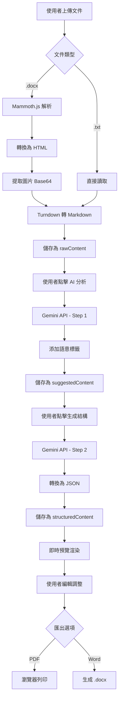

# AI 教材轉換器 - 執行計畫

> **文件版本**: 1.0  
> **建立日期**: 2025-12-01  
> **專案狀態**: 開發中

---

## 📋 專案概述

### 專案名稱
**AI 教材轉換器 (AI Courseware Converter)**

### 專案目標
開發一個基於 Web 的智慧教材製作工具，幫助教育人員將純文字或 Word 文件，透過 Google Gemini AI 的語意分析，自動排版成精美、結構清晰的 PDF 教材。

### 核心價值
- ⚡ **自動化**: AI 驅動的內容分析與格式化
- 🎨 **專業排版**: 精美的 A4 分頁預覽與 PDF 輸出
- 🔄 **即時預覽**: 所見即所得的編輯體驗
- 💾 **本地儲存**: 無需後端，資料安全可控

---

## 🎯 核心功能模組

### 1. 文件匯入與解析
- [x] 支援 `.docx` 文件上傳
- [x] 支援 `.txt` 純文字檔案
- [x] 使用 Mammoth.js 將 Word 轉為 HTML
- [x] 提取並轉換圖片為 Base64
- [x] 使用 Turndown 將 HTML 轉為 Markdown

### 2. AI 兩級智慧處理
- [x] **第一級 - 內容增強**: AI 分析內容並添加語意標籤
  - 重點提示標記
  - 定義標記
  - 警告事項標記
  - 圖片建議標記
- [x] **第二級 - 結構化生成**: 將標籤化內容轉換為 JSON 格式
  - 嚴格的 Schema 定義
  - 標籤清理與轉換
  - 表格與特殊格式處理

### 3. 即時預覽系統
- [x] WYSIWYG 所見即所得編輯
- [x] A4 分頁預覽
- [x] 支援多種內容類型渲染
  - 章節標題 (H1, H2, H3)
  - 段落
  - 表格
  - 重點框
  - 警告框
  - 定義框
  - 案例分析
  - 圖片佔位符
- [x] 目錄與頁碼計算

### 4. PDF 生成
- [x] 使用瀏覽器原生列印功能
- [x] 高解析度輸出
- [x] 自訂頁首頁尾
- [x] 表格分頁優化

---

## 🏗️ 技術架構

### 前端技術棧

| 類別 | 技術/函式庫 | 版本 | 用途 |
|------|------------|------|------|
| 核心框架 | React | 19.2.0 | UI 與狀態管理 |
| 語言 | TypeScript | 5.8.2 | 強型別開發 |
| 建置工具 | Vite | 6.2.0 | 快速開發與建置 |
| 樣式 | Tailwind CSS | CDN | 實用優先的 CSS |
| AI 模型 | Google Gemini API | 2.5 Flash | 自然語言分析 |
| 文件解析 | Mammoth.js | 1.6.0 | Word 轉 HTML |
| Markdown | Turndown | Latest | HTML 轉 Markdown |
| 儲存 | LocalStorage | - | 瀏覽器端持久化 |

### 專案結構

```
ai-教材轉換器-(ai-courseware-converter)/
├── components/           # React 元件
│   ├── Editor.tsx       # 主編輯器
│   ├── PreviewPanel.tsx # 預覽面板
│   ├── ControlPanel.tsx # 控制面板
│   ├── WelcomeScreen.tsx # 歡迎畫面
│   ├── ImagePlaceholder.tsx # 圖片佔位符
│   ├── HelpModal.tsx    # 說明對話框
│   └── ProjectSetupWizard.tsx # 專案設定精靈
├── services/            # 業務邏輯服務
│   ├── geminiService.ts # AI 服務
│   └── projectService.ts # 專案管理
├── utils/               # 工具函數
│   ├── pdfGenerator.ts  # PDF 生成
│   ├── wordGenerator.ts # Word 匯出
│   └── textUtils.ts     # 文字處理
├── types.ts             # TypeScript 型別定義
├── App.tsx              # 主應用程式
├── index.tsx            # 入口檔案
├── index.html           # HTML 模板
├── vite.config.ts       # Vite 配置
├── package.json         # 專案依賴
└── docs/                # 專案文件
    ├── 01_執行計畫.md
    ├── 02_優化改進計劃.md
    ├── 03_測試計劃.md
    └── 04_工作日誌.md
```

---

## 📅 開發里程碑

### Phase 1: 環境設置與基礎架構 ✅
**狀態**: 已完成  
**完成日期**: 2025-11-19

- [x] 建立 Vite + React + TypeScript 專案
- [x] 設定 Tailwind CSS
- [x] 定義核心資料結構 (types.ts)
- [x] 建立專案基本架構

### Phase 2: 核心功能開發 ✅
**狀態**: 已完成  
**完成日期**: 2025-11-19

- [x] 實作文件上傳與解析 (Word/TXT)
- [x] 整合 Google Gemini API
- [x] 實作 AI 兩級處理流程
- [x] 建立預覽面板與渲染邏輯
- [x] 實作 LocalStorage 資料持久化

### Phase 3: 進階功能 ✅
**狀態**: 已完成  
**完成日期**: 2025-11-19

- [x] PDF 生成功能
- [x] Word 文件匯出
- [x] 目錄與頁碼計算
- [x] 圖片管理系統
- [x] 所見即所得編輯
- [x] 樣式自訂功能

### Phase 4: 優化與測試 🔄
**狀態**: 進行中  
**預計完成**: 2025-12-15

- [ ] 效能優化 (LocalStorage、防抖機制)
- [ ] 安全性改進 (API Key 保護)
- [ ] 錯誤處理完善
- [ ] 程式碼重構 (分離業務邏輯)
- [ ] 圖片壓縮功能
- [ ] 使用者體驗增強

### Phase 5: 部署與文件 📋
**狀態**: 待開始  
**預計完成**: 2025-12-31

- [ ] 建立部署文件
- [ ] 撰寫使用者手冊
- [ ] 建立範例教材
- [ ] 部署至生產環境 (Vercel/Netlify)
- [ ] 效能監控設置

---

## 🔄 核心業務流程

### 工作流程圖



### 資料流轉

1. **輸入階段**: 文件 → HTML → Markdown → `rawContent`
2. **AI 增強**: `rawContent` → AI 分析 → `suggestedContent`
3. **結構化**: `suggestedContent` → AI 格式化 → `structuredContent`
4. **渲染**: `structuredContent` → React 元件 → 預覽畫面
5. **輸出**: 預覽畫面 → PDF/Word

---

## 🔑 關鍵技術決策

### 1. 為何選擇 LocalStorage？
**決策**: 使用 LocalStorage 而非後端資料庫

**理由**:
- ✅ 無需後端伺服器，降低部署成本
- ✅ 資料完全在本地，隱私安全
- ✅ 快速原型開發
- ⚠️ 限制: 5-10MB 容量限制

**未來考慮**: 遷移至 IndexedDB（容量更大）

### 2. 為何使用瀏覽器列印而非 jsPDF？
**決策**: 使用 `window.print()` 而非 jsPDF

**理由**:
- ✅ 更高的解析度與品質
- ✅ 原生支援複雜排版
- ✅ 無需額外依賴套件
- ✅ 支援自訂頁首頁尾

### 3. 為何採用兩級 AI 處理？
**決策**: 分為「內容增強」與「結構化生成」兩階段

**理由**:
- ✅ 分離關注點，提高準確性
- ✅ 使用者可在中間階段檢視與調整
- ✅ 降低單次 AI 請求的複雜度
- ✅ 更好的錯誤處理與除錯

### 4. 為何使用 Tailwind CDN？
**決策**: 透過 CDN 載入 Tailwind CSS

**理由**:
- ✅ 快速原型開發
- ⚠️ 限制: 不適合生產環境
- 📋 待改進: 安裝正式版本

---

## 🚀 快速開始指南

### 環境需求
- Node.js >= 18.0.0
- npm >= 9.0.0
- Google Gemini API Key

### 安裝步驟

```bash
# 1. 進入專案目錄
cd d:\project\AI教材轉換\ai-教材轉換器-(ai-courseware-converter)

# 2. 安裝依賴
npm install

# 3. 設定環境變數
# 編輯 .env.local 檔案，加入：
# GEMINI_API_KEY=your_api_key_here

# 4. 啟動開發伺服器
npm run dev

# 5. 開啟瀏覽器
# 訪問 http://localhost:3000
```

### 建置生產版本

```bash
# 建置
npm run build

# 預覽建置結果
npm run preview
```

---

## 📊 專案狀態追蹤

### 目前進度
- **整體完成度**: 85%
- **核心功能**: 100% ✅
- **優化改進**: 20% 🔄
- **測試覆蓋**: 0% ❌
- **文件完整度**: 60% 🔄

### 待辦事項 (按優先級)

#### 🔴 高優先級
1. [ ] LocalStorage 容量錯誤處理
2. [ ] API Key 安全性改進
3. [ ] AI 錯誤訊息優化
4. [ ] 防抖機制改進

#### 🟡 中優先級
5. [ ] 圖片壓縮功能
6. [ ] Editor.tsx 重構
7. [ ] TypeScript 型別安全改進
8. [ ] AI Prompt 管理優化

#### 🟢 低優先級
9. [ ] 自動儲存指示器
10. [ ] 復原/重做功能
11. [ ] 測試覆蓋率
12. [ ] IndexedDB 遷移

---

## 📞 聯絡資訊

### 專案負責人
- **開發者**: [您的名字]
- **Email**: [您的 Email]

### 相關資源
- **開發者手冊**: `AI 教材轉換器 開發者手冊1141119.pdf`
- **使用者手冊**: `USER_MANUAL.md`
- **優化建議**: `docs/02_優化改進計劃.md`
- **測試計劃**: `docs/03_測試計劃.md`

---

## 📝 版本歷史

| 版本 | 日期 | 變更內容 |
|------|------|---------|
| 1.0 | 2025-12-01 | 初始版本，建立執行計畫文件 |

---

**最後更新**: 2025-12-01  
**文件維護**: 請在每次重要變更後更新此文件
